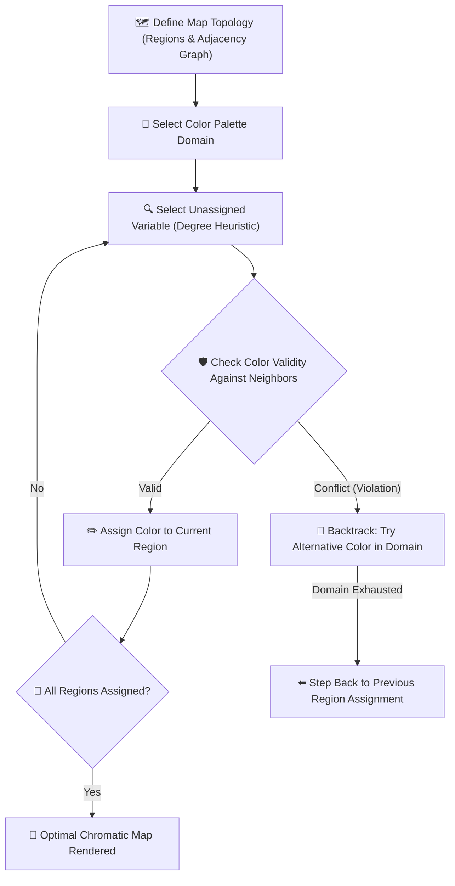

# 🗺️ AI Problem Solving — Constraint Satisfaction Problem (CSP) Map Coloring

<div align="center">

[](https://python.org)
[](https://developer.mozilla.org/en-US/docs/Web/API/Canvas_API)
[](https://docs.python.org/3/library/tkinter.html)
[](https://en.wikipedia.org/wiki/Constraint_satisfaction_problem)
[](LICENSE)

**An interactive Constraint Satisfaction Problem (CSP) solver that colors map regions without neighboring color collisions, featuring Backtracking Search, Degree Heuristics, Tkinter desktop GUI, and interactive HTML5 Web Canvas.**

</div>

---

## 📌 Problem Formulation

The **Map Coloring Problem** is a foundational Constraint Satisfaction Problem (CSP) in Artificial Intelligence:
- **Variables ($V$)**: Distinct planar map regions / political boundaries $\{R_1, R_2, \dots, R_n\}$.
- **Domains ($D$)**: Set of available colors $\{C_1, C_2, \dots, C_k\}$ (governed by the **Four Color Theorem**, establishing that at most 4 colors suffice for any planar graph).
- **Constraints ($C$)**: For every pair of adjacent regions $(R_i, R_j) \in \text{Edges}$, $\text{Color}(R_i) \neq \text{Color}(R_j)$.

---

## 🏗️ Algorithmic Mechanics



---

## 🚀 Key Features

- **🧠 Backtracking Search Engine**:
  - Implements recursive depth-first backtracking search to systematically explore the assignment space.
  - Efficient constraint checking ensuring zero adjacent region collisions.
- **🖥️ Dual Interface Implementations**:
  1. **Interactive Python Tkinter GUI (`map_coloring_csp.py`)**:
     - Visual node graph rendering, real-time adjacency linking, step-by-step color assignment visualizer, and dynamic color paletting.
  2. **Zero-Install Web Canvas (`index.html`)**:
     - Browser-native HTML5 Canvas drag-and-drop node graph with instant CSP solving and chromatic validation.
- **📐 Graph Theoretical Bounds**:
  - Computes chromatic lower bounds and maximum vertex degree bounds to guide heuristic selection.

---

## 📂 Repository Structure

```bash
AI_ProblemSolving_-RA2411026050071-/
├── map_coloring_csp.py     # Python Tkinter desktop GUI & CSP backtracking solver
├── index.html              # Standalone web visualizer (interactive HTML5 Canvas)
└── README.md
```

---

## 🛠️ Quickstart Guide

### Option 1: Run Desktop Python GUI

```bash
# Clone the repository
git clone https://github.com/Manukrishna1971/AI_ProblemSolving_-RA2411026050071-.git
cd AI_ProblemSolving_-RA2411026050071-

# Launch the Tkinter GUI (Tkinter is built into standard Python distributions)
python map_coloring_csp.py
```

### Option 2: Run Web Interface

Simply open `index.html` in any web browser, or host it locally:
```bash
# Using Python built-in HTTP server
python -m http.server 8080
```
Open **[http://localhost:8080](http://localhost:8080)** to explore the live visual graph solver.

---

## 🧪 Example Execution

**Sample Adjacency Matrix:**
```text
Regions: [North, West, Central, East, South]
Adjacency:
  North   → [West, Central, East]
  West    → [North, Central, South]
  Central → [North, West, East, South]
  East    → [North, Central, South]
  South   → [West, Central, East]
```

**CSP Solution Output:**
```text
North   → 🟢 Green
West    → 🔴 Red
Central → 🔵 Blue
East    → 🔴 Red
South   → 🟢 Green
Total Colors Used: 3 (Within planar 4-color bound)
All Constraints Verified: True
```

---

## 📄 License & Attribution

Distributed under the **MIT License**. Maintained by [Manukrishna](https://github.com/Manukrishna1971) and collaborators.
